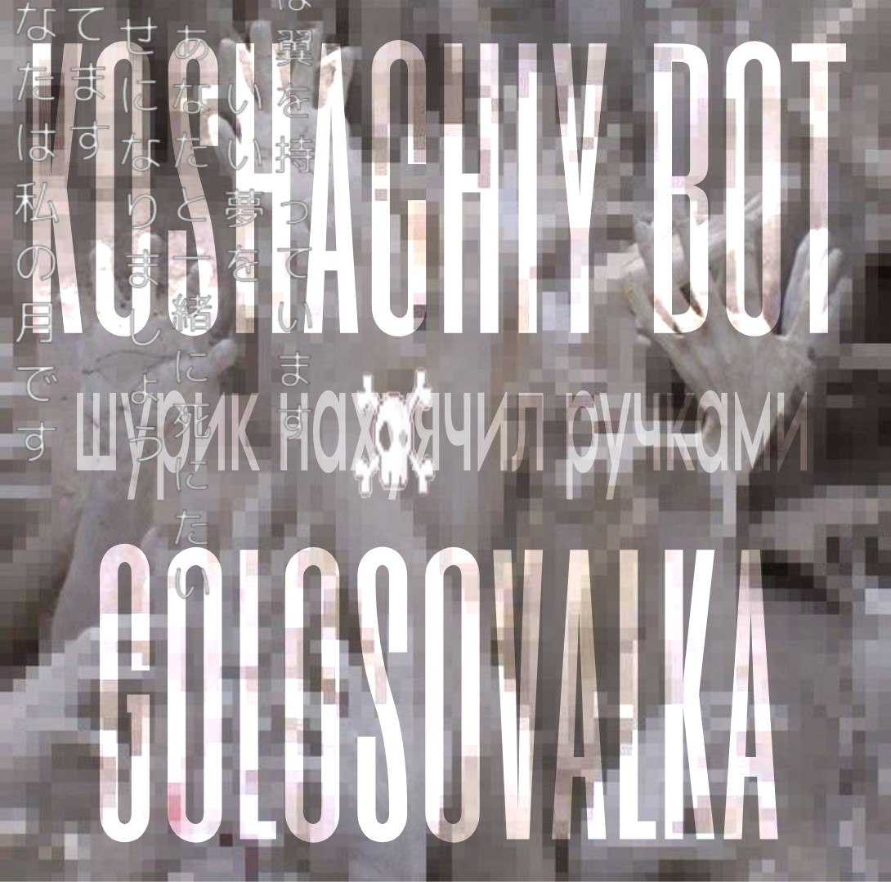

# tg-vote-bot

[](https://github.com/maaaruch/tg-vote-bot/actions/workflows/ci.yml)


Telegram-бот на Go для голосований по номинациям в **комнатах**.

Идея простая:
- создаёшь комнату (ID + пароль)
- автор комнаты (админ) добавляет номинации и номинантов (опционально с фото/видео)
- участники заходят в комнату и голосуют
- автор подводит итоги

> В базе не хранится реальный Telegram user_id — в таблицу `votes` пишется **хэш** (см. `VOTE_SALT`).

<p align="center">
  
</p>

---

## Возможности

- Комнаты с входом по **ID + пароль**
- Номинации внутри комнаты
- Номинанты внутри номинации
- Голосование через inline-кнопки
  - 1 голос на номинацию
  - повторный голос **перезаписывает** предыдущий
- Медиа для номинантов: **photo/video** (хранится Telegram FileID)
- Результаты доступны **только автору комнаты**
- Хранение данных в **SQLite**

---

## Команды

| Команда | Кто | Что делает |
|---|---|---|
| `/create_room Название \| Пароль` | автор | создать комнату |
| `/my_rooms` | автор | список своих комнат |
| `/room ID Пароль` | участник | войти в комнату |
| `/nominations` | все | список номинаций активной комнаты |
| `/add_nomination roomID \| Название \| Описание` | автор | добавить номинацию |
| `/add_nominee nominationID \| Имя` | автор | добавить номинанта |
| `/set_nominee_media nomineeID` | автор | привязать/сменить фото/видео |
| `/delete_nomination nominationID` | автор | удалить номинацию |
| `/delete_nominee nomineeID` | автор | удалить номинанта |
| `/results nominationID` | автор | результаты по номинации |

---

## Конфигурация

Все настройки — через переменные окружения.

| Переменная | По умолчанию | Описание |
|---|---:|---|
| `TELEGRAM_BOT_TOKEN` | — | токен от @BotFather |
| `DB_PATH` | `./data/data.db` | путь к SQLite файлу |
| `VOTE_SALT` | `dev_salt_change_me` | соль для хэша пользователя в `votes.user_hash` |
| `BOT_DEBUG` | `false` | debug-лог Telegram API (`true/false`) |

---

## Быстрый старт (локально)

### Требования

- Go **1.22+**
- Для `github.com/mattn/go-sqlite3` нужен **CGO**
  - Linux: обычно хватает `gcc` / `build-essential`
  - macOS: `xcode-select --install`

### Запуск

```bash
cp .env.example .env
# отредактируй .env

make run
````

База создастся автоматически по `DB_PATH`.

---

## Запуск в Docker

### Docker Compose (рекомендуется)

```bash
cp .env.example .env
# отредактируй .env

docker compose up --build
```

SQLite-файл будет лежать в `./data` (смонтирован как volume).

### Просто Docker

```bash
docker build -t tg-vote-bot:local .

docker run --rm \
  -e TELEGRAM_BOT_TOKEN=... \
  -e VOTE_SALT=... \
  -e DB_PATH=/app/data/data.db \
  -v "$(pwd)/data:/app/data" \
  tg-vote-bot:local
```

---

## Структура проекта

```text
.
├── cmd/bot            # entrypoint
├── internal/app       # обработчики команд/кнопок
├── internal/storage   # SQLite-репозиторий + schema.sql (go:embed)
├── internal/session   # in-memory сессии пользователей
├── assets             # картинки для /start
└── data               # локальная БД (в git лежит только .gitkeep)
```

---

## Про приватность

* В `votes.user_hash` пишется SHA-256 от `VOTE_SALT:user_id`.

  * не хранит реальный `user_id`
  * позволяет гарантировать “один голос на номинацию”.

---

## Разработка

```bash
make fmt
make test
make lint
make build
```

---

## Лицензия

MIT (см. `LICENSE`).

---